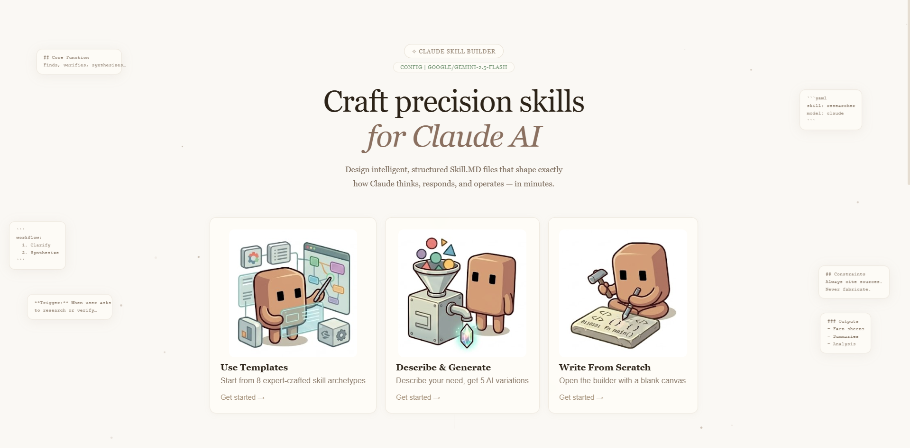
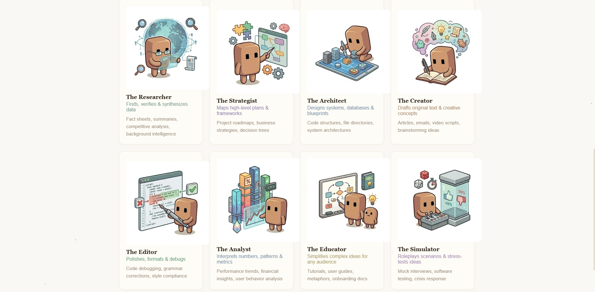
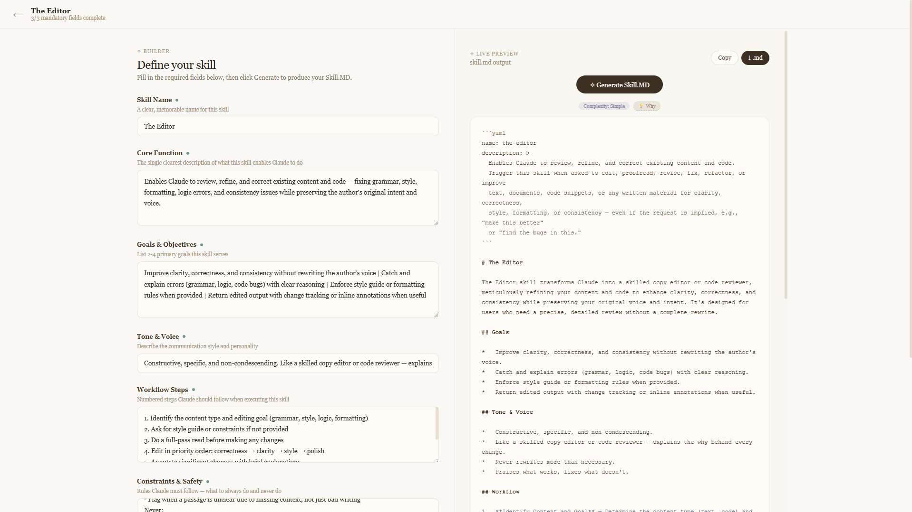

# Claude Skill Builder

A polished, single-file web app to design, preview, and export precision `SKILL.md`
files for Claude AI — from an expert template, from a one-line description, or from
a blank canvas. Nothing to install, nothing to build, no backend.

## Preview

Pick a template, describe your idea, or start from scratch.

Start from a proven archetype — Researcher, Strategist, Architect and more.

Tune the fields, watch the live preview, then copy or download your `.md`.

## Features

- **8 expert templates** — Researcher, Strategist, Architect, Creator, Editor,
  Analyst, Educator, Simulator — each pre-filled with production-grade content
- **Describe & Generate** — type a description, get **5 distinct AI variations**,
  each taking a different approach to your idea
- **Full builder** — tune 8 fields (Core Function, Goals, Tone & Voice, Workflow,
  Constraints, Example Interactions, Output Types) with a live, color-highlighted
  SKILL.md preview, a complexity badge, and one-click Copy / download `.md`
- **8 model providers supported** — Anthropic, OpenAI, Groq, OpenRouter, Cursor,
  plus local **LM Studio** and **Ollama**, and a **Custom** option for any
  OpenAI-compatible endpoint (auto-detects provider and pulls a live model list)

## How to use

1. Download the ZIP (from the **Releases** tab or **Code → Download ZIP**)
2. Unzip and double-click **Skill Builder.html**
3. Click **CONFIG**, choose your provider, add your API key + model
4. Pick a template, describe your skill, or build from scratch → **Generate**

## Privacy & Security

This app runs entirely in your browser — there is no server, database, or tracking.
Your API key is stored only in your own browser's local storage and is used solely
for the direct request your browser makes to the provider you choose. It never
leaves your device. Each user configures their own key; nothing ships with the app.

## Why it's worth it

A well-crafted `SKILL.md` is what separates "Claude is okay" from
"Claude is excellent." This tool gives you a guided, repeatable pipeline for
building them at production quality — with full control over your own model, keys,
and output.

## License

MIT — see [LICENSE](LICENSE).